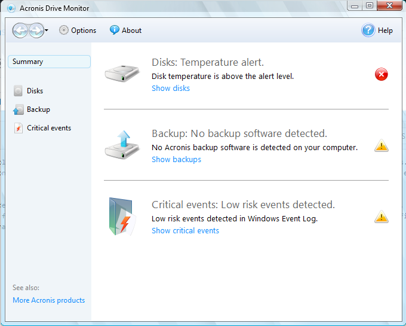

Acronis Drive Monitor es una aplicación gratuita de software que monitoriza el estado del disco duro de servidores, PC´s y portátiles. Además, alerta a los usuarios de los problemas que pueden ocasionar un fallo inminente en el sistema y, con ello, permite a los usuarios salvar los datos almacenados en el disco duro y preparar su sustitución.

Cuando Acronis Drive Monitor identifica un problema, genera un email o una alerta en la pantalla que describe el síntoma descubierto. Además ofrece una explicación sencilla y fácil de entender y facilita a los usuarios los pasos a seguir para solucionar la incidencia en cuestión. Un sumario codificado por colores ofrece una vista rápida del estado del disco y hace un reporte semanal de los problemas identificados.

[Enlace del programa](https://acronis-drive-monitor.softonic.com/)
