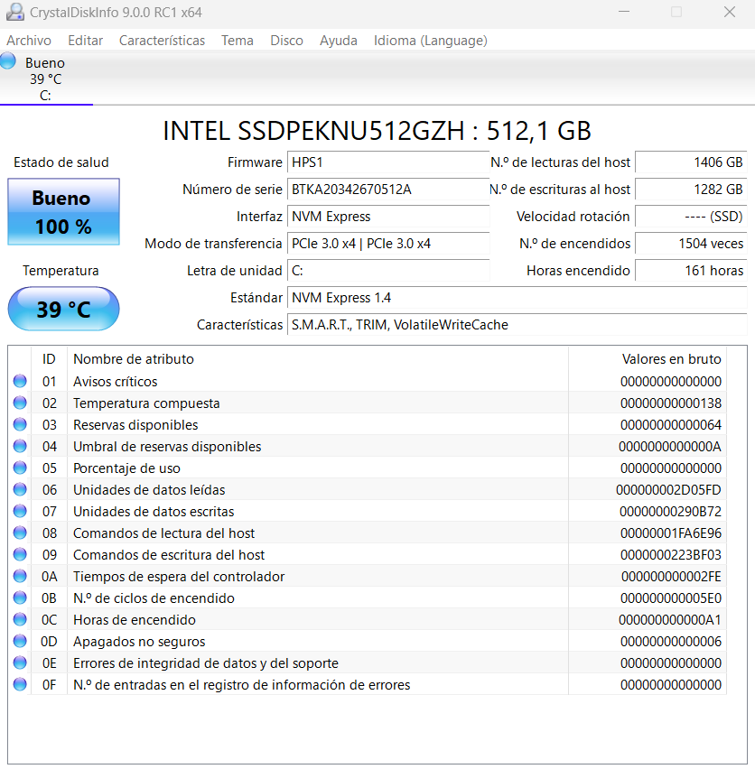

El programa permite controlar el funcionamiento del disco o discos instalados en el ordenador, vigilando su estado de salud al incluir la temperatura que alcanza en cada momento y los atributos SMART, con completa información textual y gráfica.

CrystalDiskInfo muestra también detallada información sobre el hardware de cada unidad de disco, así como el número de serie y todas las configuraciones que admiten, en función de las características que presentan.

[Enlace del programa](https://crystaldiskinfo.uptodown.com/windows)

[Video](https://youtu.be/HRVLjenyQIE)
