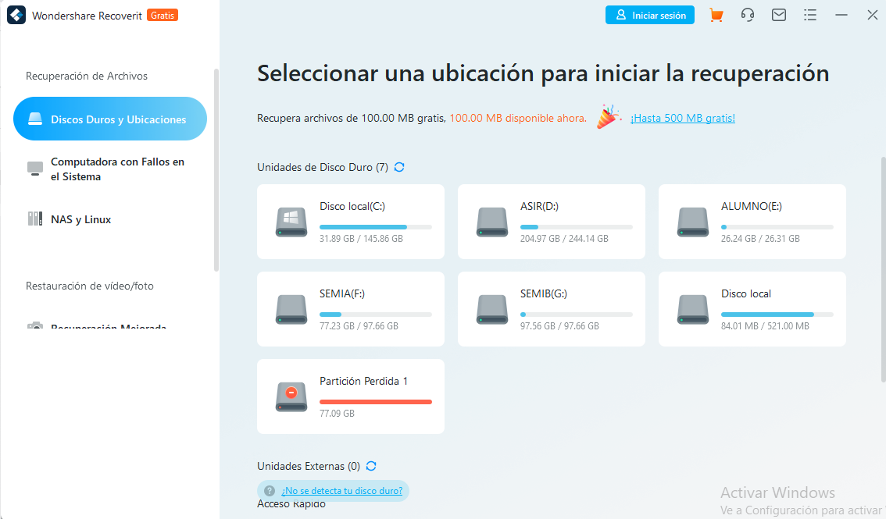

Recoverit Data Recovery Gratis es una herramienta potente y profesional que es extremadamente rápida y fiable. Puede recuperar casi todos los archivos de cualquier unidad.Con esta herramienta se pueden recuperar fotos borradas y todo tipo de archivos perdidos y/o eliminados, incluyendo audio, música o correos que estuvieran almacenados en cualquier tipo de dispositivo. Este software lleva a cabo de forma rápida y sencilla la recuperación de datos de la papelera, del disco duro, de tarjetas de memoria y unidades flash, de cámaras digitales y hasta de cámaras de video.

[Enlace del programa](https://recoverit.wondershare.es/deleted-recovery/undelete-freewares.html)

