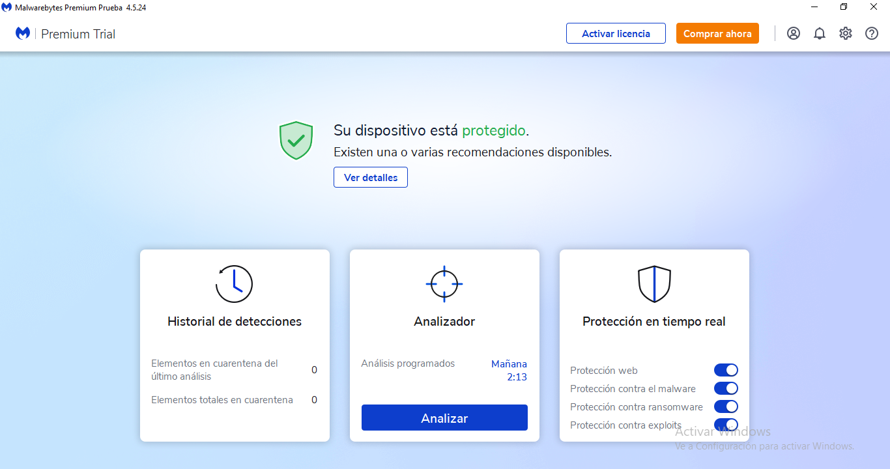

Malwarebytes es un programa antivirus muy potente capaz de detectar casi cualquier amenaza, incluso en su versión gratuita. Los antivirus siempre han sido programas que, al activar la protección a tiempo real y establecer análisis del PC programados, se vuelven bastante lentos en ordenadores de bajas prestaciones. Malwarebytes viene a solucionar este problema ya que no consume tantos recursos como otros, mientras que ofrece protecciones de alto nivel.

El antivirus Malwarebytes ofrece protección contra malware, ransomware y muchos más tipos de virus que circulan por la red. Aquí mismo tienes una guía de Malwarebytes. Su base de datos se actualiza periódicamente y, con cada nueva amenaza que surge en la red, la añaden a su lista de bloqueo para que el programa la detecte y la deje fuera de servicio. En el caso de que tengas problemas con el ordenador y no sepas por qué son, probablemente se deban a archivos maliciosos. Podrás dejar estos archivos en cuarentena para ver si se solucionan los fallos y, si lo hacen, eliminarlos completamente del equipo. Así pues, Malwarebytes también puede limpiar PCs con virus con tan solo instalarlo y ejecutar un escaneo rápido, que no suele llevar más de unos pocos minutos.

[Enlace del programa](https://es.malwarebytes.com/)

